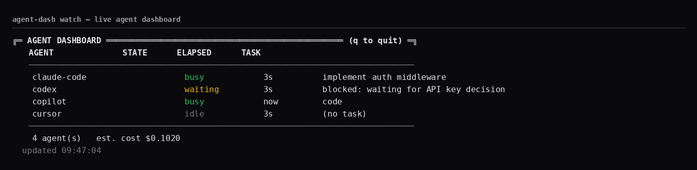
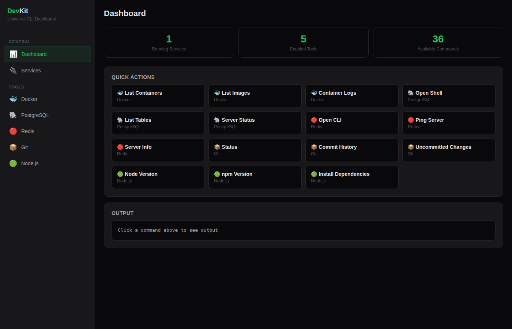

# 🍺 Homebrew Tap — Gopal-student21

A Homebrew tap for command-line tools built by [Gopal-student21](https://github.com/Gopal-student21).

A *tap* is Homebrew's way of distributing software from custom repositories.
This repo is the delivery mechanism: every tool below installs with a single
`brew install` command — no manual downloads, no PATH setup, no build steps.

---

## 📦 Available tools

| Tool | Description | Install |
| ---- | ----------- | ------- |
| **agent-dash** | Mission control for AI coding agents — live status, task, elapsed time and cost for Claude Code, Cursor, Codex and more | `brew install gopal-student21/tap/agent-dash` |

> More tools are published here as they ship.

---

## 🖥 Screenshots

**agent-dash** — live agent dashboard (`agent-dash watch`):



**DevKit** — visual web dashboard (`dev serve` at `localhost:8080`):



---

## 🚀 Quick start

```sh
# 1. Install the tool (macOS or Linux with Homebrew)
brew install gopal-student21/tap/agent-dash

# 2. Verify
agent-dash version

# 3. Report an agent's state
agent-dash probe claude-code --state busy --task "implement auth middleware" --cost 0.05

# 4. See everything in one place
agent-dash watch
```

---

## 🧭 What is agent-dash?

A CLI dashboard that gives you a single live view of all your AI coding agents:

- **who** is running
- **what** task each agent is on
- **whether** they are `idle`, `busy`, or `waiting` (and for how long)
- **how much** it costs

It works by letting agents report their state (`agent-dash probe`), which the
dashboard merges with real processes it discovers from the OS process table.

### Commands

```text
agent-dash probe <name> --state <idle|busy|waiting> [--task "..." --tokens-in N --tokens-out N --cost USD]
agent-dash list      # one-shot summary table
agent-dash watch     # live dashboard, refreshes every 2s (Ctrl+C to quit)
agent-dash report    # full state as JSON
agent-dash version
```

### How it works

1. Agents (or their scripts/hooks) call `agent-dash probe <name> --state ...` to report status.
2. Status is stored locally as JSON in `~/.agent-dash/state/<name>.json`.
3. `list` / `watch` merge those records with agents auto-discovered from running processes.
4. Re-probing the same name **accumulates** tokens and cost over time.

### Install without Homebrew

Prefer `go install` or direct downloads?

```sh
go install github.com/gopal-student21/agent-dash@latest
```

Or grab the latest release binaries from the
[releases page](https://github.com/Gopal-student21/agent-dash/releases)
(`agent-dash_<version>_linux_amd64.tar.gz`, `..._darwin_arm64.tar.gz`, etc.).

---

## 🔄 Updating

```sh
brew update
brew upgrade gopal-student21/tap/agent-dash
```

---

## 🛠 How this tap is maintained

- The `agent-dash.rb` formula in this repo is **auto-generated by GoReleaser** on
  every release — do not edit it by hand.
- Each release pins the exact download URL and SHA256 checksum, so installs are
  reproducible and tamper-checked.
- Reporting issues: open an issue on the
  [agent-dash repository](https://github.com/Gopal-student21/agent-dash).

---

## ⚖️ License

Each tool carries its own license; see the individual repositories.
